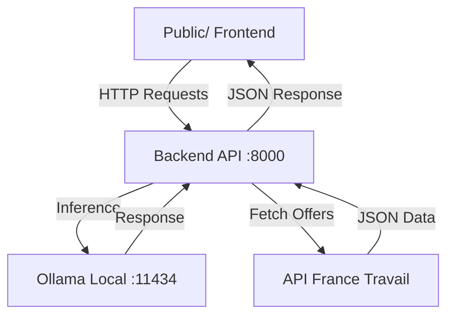

<div align="center">
  <h1 align="center">NextStep AI</h1>
  
  <p align="center">
    <strong>L'Orientation Professionnelle Réinventée par l'Intelligence Artificielle Locale</strong>
  </p>

  <p align="center">
    <a href="#-fonctionnalités">Fonctionnalités</a> •
    <a href="#-installation">Installation</a> •
    <a href="#-technologies">Technologies</a> •
    <a href="#-architecture">Architecture</a>
  </p>

  <p align="center">
    
    
    
    
    
  </p>
</div>

---

## 💡 Présentation

**NextStep** est une plateforme de nouvelle génération qui connecte les étudiants aux opportunités d'alternance grâce à une synergie unique entre **l'Intelligence Artificielle Locale (Privacy-First)** et les **Données Officielles de l'État**.

Fini les recherches fastidieuses. NextStep agit comme un **Mentor IA Personnel** qui analyse votre CV, comprend vos compétences, et les matche en temps réel avec le marché du travail local.

---

## ✨ Fonctionnalités

| Fonctionnalité | Description |
| :--- | :--- |
| **🗺️ Pathfinder** | Une carte interactive immersive affichant les offres d'alternance autour de vous (< 20km) en temps réel, basées sur l'API France Travail. |
| **🤖 Coach IA Expert** | Un assistant conversationnel propulsé par **Llama 3.2** qui répond à vos questions, détaille les entreprises et vous coach pour les entretiens. |
| **🧠 Gap Analysis** | L'IA croise votre CV (PDF) avec les pré-requis de chaque offre pour identifier vos points forts (Hard/Soft Skills) et maximiser vos chances. |
| **🛡️ 100% Local Privacy** | **Aucune donnée personnelle n'est envoyée aux GAFAM.** Tout le traitement IA se fait en local via Ollama. Vos données restent chez vous. |
| **📄 Analyse Semantique** | Extraction et compréhension automatique du CV pour un matching précis avec les codes ROME (Répertoire Opérationnel des Métiers). |

---

## 🛠️ Technologies

<div align="center">

| Composant | Technologie | Rôle |
| :--- | :--- | :--- |
| **Backend** |  | API Gateway, Proxy France Travail, Gestion Ollama |
| **IA Engine** |  | Moteur d'inférence local (Llama 3.2 / Mistral) |
| **Frontend** |   | Interface fluide, MapLibre, PDF.js |
| **Data** |  | Source de vérité pour les offres d'emploi |

</div>

---

## 🚀 Installation

### Pré-requis
*   **Python 3.8+**
*   **[Ollama](https://ollama.ai/)** installé et actif.
*   Modèle téléchargé : `ollama pull llama3.2`

### 1. Cloner et Installer le Backend
Le cerveau de l'application (API Python).

```bash
cd backend
pip install -r requirements.txt
# Lancer le serveur API (Port 8000)
uvicorn app.main:app --host 127.0.0.1 --port 8000 --reload
```

### 2. Lancer le Frontend
L'interface utilisateur (Serveur Web).

```bash
cd public
# Lancer le serveur Web (Port 8080)
python3 -m http.server 8080
```

### 3. Accéder à l'application
Ouvrez simplement votre navigateur :
> **http://localhost:8080**

---

## 📂 Structure du Projet



---

<div align="center">
  <p>Fait avec ❤️ pour le Hackathon NextStep</p>
  <p>© 2026 NextStep AI - Tous droits réservés.</p>
</div>
