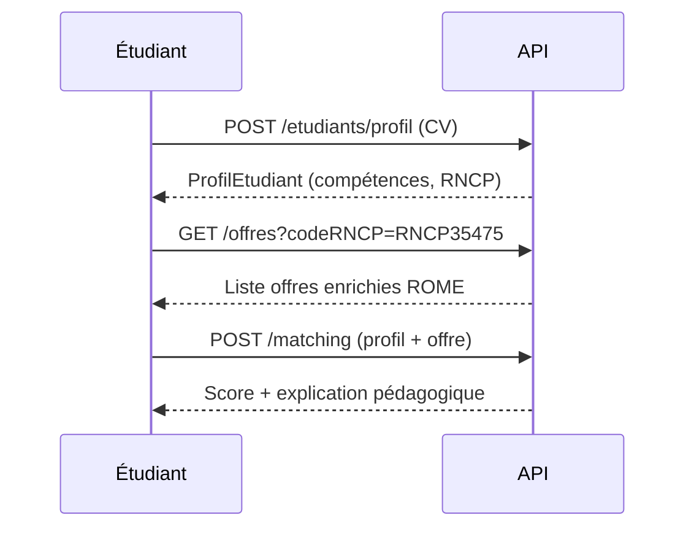
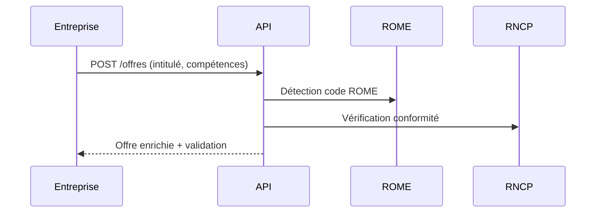

# 📘 Documentation Technique - NextStep API

## Vue d'ensemble

**NextStep API** est une API REST permettant le matching pédagogique entre étudiants et offres d'alternance, basée sur les référentiels officiels **ROME** (métiers) et **RNCP** (certifications).

### Informations Générales
- **Version**: 1.0.0
- **URL de base**: `https://api.nextstep.fr/v1`
- **Format**: JSON
- **Authentification**: API Key (header `X-API-Key`)
- **Limite d'appels**: 1000 requêtes/jour
- **Disponibilité**: 99,9%

---

## 🔐 Authentification

Toutes les requêtes nécessitent une clé API dans le header :

```bash
curl -H "X-API-Key: VOTRE_CLE_API" https://api.nextstep.fr/v1/offres
```

### Obtenir une clé API
1. Créer un compte sur [api.gouv.fr](https://api.gouv.fr)
2. Demander l'accès à "NextStep API"
3. Récupérer votre clé dans votre tableau de bord

---

## 📚 Endpoints Principaux

### 1. Récupérer les offres

```http
GET /offres?codeROME=M1805&ville=Marseille&distance=10
```

**Paramètres de requête** :
| Paramètre | Type | Description | Exemple |
|-----------|------|-------------|---------|
| `codeROME` | string | Code métier ROME | `M1805` |
| `ville` | string | Ville de recherche | `Marseille` |
| `distance` | integer | Rayon en km | `10` |
| `codeRNCP` | string | Certification RNCP | `RNCP35475` |

**Réponse** :
```json
[
  {
    "id": "offre-123",
    "entreprise": "Airbus",
    "intitule": "Développeur Full Stack IA",
    "codeROME": "M1805",
    "libelleROME": "Études et développement informatique",
    "competencesROME": [
      "Programmation orientée objet",
      "Développement web",
      "Gestion de bases de données"
    ],
    "codeRNCP": "RNCP35475",
    "formationsCompatibles": [
      "BUT Informatique",
      "Licence Pro Développement"
    ],
    "localisation": {
      "ville": "Marseille",
      "latitude": 43.2965,
      "longitude": 5.3698
    },
    "typeContrat": "Apprentissage",
    "datePublication": "2026-02-05T10:00:00Z"
  }
]
```

---

### 2. Calculer le matching pédagogique

```http
POST /matching
Content-Type: application/json
```

**Corps de la requête** :
```json
{
  "profilEtudiant": {
    "nom": "Sophie Martin",
    "formation": "BUT Informatique",
    "codeRNCP": "RNCP35475",
    "competences": ["React", "Node.js", "Python"],
    "localisation": {
      "ville": "Marseille",
      "latitude": 43.2965,
      "longitude": 5.3698
    }
  },
  "offreId": "offre-123"
}
```

**Réponse** :
```json
{
  "score": 85,
  "competencesAcquises": [
    "Développement web",
    "Programmation orientée objet"
  ],
  "competencesManquantes": [
    "Gestion de bases de données"
  ],
  "conformiteRNCP": true,
  "explication": "Votre profil correspond à 85% au référentiel ROME M1805. Votre formation BUT Informatique couvre les compétences requises. Il vous manque : Gestion de bases de données (recommandation : module SQL Avancé)."
}
```

---

### 3. Analyser un CV

```http
POST /etudiants/profil
Content-Type: multipart/form-data
```

**Paramètres** :
- `cv` : Fichier PDF du CV

**Réponse** :
```json
{
  "nom": "Sophie Martin",
  "formation": "BUT Informatique",
  "codeRNCP": "RNCP35475",
  "competences": ["React", "Node.js", "Python", "Git"],
  "codeROMESuggere": "M1805",
  "localisation": {
    "ville": "Marseille"
  }
}
```

---

### 4. Détails d'un code ROME

```http
GET /rome/M1805
```

**Réponse** :
```json
{
  "code": "M1805",
  "libelle": "Études et développement informatique",
  "definition": "Concevoir, développer et mettre au point un projet d'application informatique",
  "competences": [
    "Programmation orientée objet",
    "Développement web",
    "Gestion de bases de données",
    "Tests et débogage",
    "Méthodes agiles"
  ],
  "formations": [
    "BUT Informatique",
    "Licence Pro Développement",
    "Master Informatique"
  ],
  "metiers": [
    "Développeur Full Stack",
    "Développeur Web",
    "Développeur Mobile",
    "Ingénieur logiciel"
  ]
}
```

---

### 5. Détails d'une certification RNCP

```http
GET /rncp/RNCP35475
```

**Réponse** :
```json
{
  "code": "RNCP35475",
  "intitule": "BUT - Informatique",
  "niveau": "Niveau 6 (Bac+3)",
  "competences": [
    {
      "code": "C1",
      "libelle": "Réaliser un développement d'application"
    },
    {
      "code": "C2",
      "libelle": "Optimiser des applications informatiques"
    },
    {
      "code": "C3",
      "libelle": "Administrer des systèmes informatiques communicants complexes"
    }
  ],
  "codesROMEAssocies": ["M1805", "M1806", "M1810"]
}
```

---

## 🔄 Flux de Données

### Scénario 1 : Étudiant cherche une alternance



### Scénario 2 : Entreprise publie une offre



---

## 🧪 Exemples de Code

### JavaScript (Fetch)

```javascript
// Récupérer les offres
const response = await fetch('https://api.nextstep.fr/v1/offres?codeROME=M1805', {
  headers: {
    'X-API-Key': 'VOTRE_CLE_API',
    'Accept': 'application/json'
  }
});
const offres = await response.json();
console.log(offres);
```

### Python (Requests)

```python
import requests

headers = {
    'X-API-Key': 'VOTRE_CLE_API',
    'Accept': 'application/json'
}

# Matching pédagogique
data = {
    "profilEtudiant": {
        "nom": "Sophie Martin",
        "formation": "BUT Informatique",
        "codeRNCP": "RNCP35475",
        "competences": ["React", "Node.js"]
    },
    "offreId": "offre-123"
}

response = requests.post(
    'https://api.nextstep.fr/v1/matching',
    headers=headers,
    json=data
)
resultat = response.json()
print(f"Score: {resultat['score']}%")
print(f"Explication: {resultat['explication']}")
```

### cURL

```bash
# Détails d'un code ROME
curl -X GET "https://api.nextstep.fr/v1/rome/M1805" \
  -H "X-API-Key: VOTRE_CLE_API" \
  -H "Accept: application/json"
```

---

## ⚠️ Codes d'Erreur

| Code | Message | Description |
|------|---------|-------------|
| 200 | OK | Requête réussie |
| 201 | Created | Ressource créée |
| 400 | Bad Request | Paramètres invalides |
| 401 | Unauthorized | Clé API manquante ou invalide |
| 404 | Not Found | Ressource introuvable |
| 429 | Too Many Requests | Limite d'appels dépassée |
| 500 | Internal Server Error | Erreur serveur |

**Exemple de réponse d'erreur** :
```json
{
  "error": {
    "code": 400,
    "message": "Code ROME invalide",
    "details": "Le code M9999 n'existe pas dans le référentiel ROME"
  }
}
```

---

## 📊 Limites et Quotas

| Ressource | Limite |
|-----------|--------|
| Requêtes/jour | 1000 |
| Requêtes/minute | 60 |
| Taille max CV | 5 MB |
| Timeout | 30 secondes |

---

## 🔗 Ressources Externes

- **Référentiel ROME** : https://www.data.gouv.fr/datasets/rome
- **Référentiel RNCP** : https://www.data.gouv.fr/datasets/rncp
- **API France Travail** : https://api.francetravail.io

---

## 📞 Support

- **Email** : support@nextstep.fr
- **Documentation** : https://docs.nextstep.fr
- **Status** : https://status.nextstep.fr

---

**Version** : 1.0.0  
**Dernière mise à jour** : 5 février 2026
